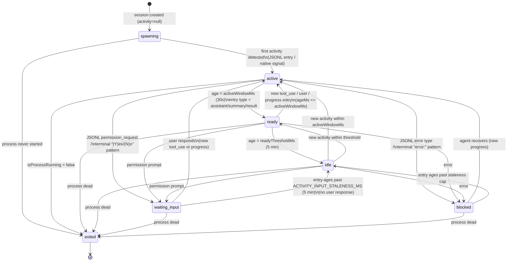
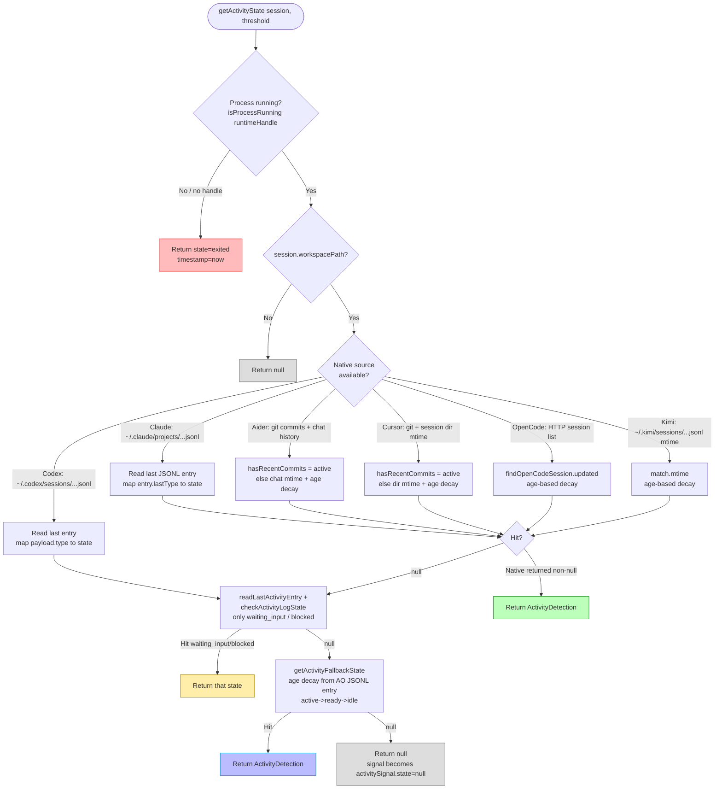
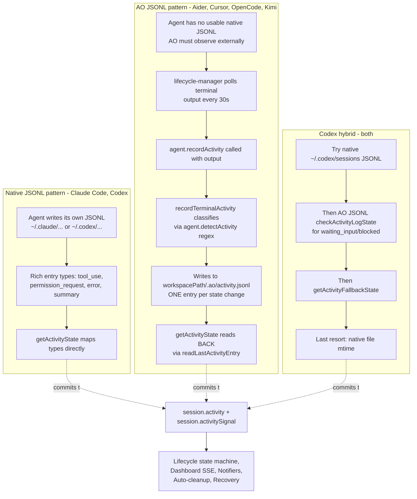

# Activity Detection — Full System Map

> Reference map of how activity detection works across the lifecycle manager, session manager, and the six agent plugins. File:line citations are accurate as of 2026-05-17 — re-verify if the cited files have moved.

---

## Why we need activity detection

Activity detection produces a 6-state `ActivityState` (`active`/`ready`/`idle`/`waiting_input`/`blocked`/`exited`) that is written to `Session.activity` and `Session.activitySignal` (`packages/core/src/types.ts:140-173, 285-289`). It is the **single source of truth** for "is the agent doing something right now?" — separate from the lifecycle status (`pr_open`, `ci_failed`, etc.) and used in concert with it.

### Consumers

#### 1. Lifecycle state machine (`packages/core/src/lifecycle-manager.ts`)

The poll loop reads `getActivityState` once per session per tick. The returned state directly drives lifecycle transitions:

- **`waiting_input` → forces `needs_input`** — `lifecycle-manager.ts:1022-1029` (native), `:1053-1060` (terminal fallback). Short-circuits the entire poll; PR/SCM/agent-report logic doesn't even run for this tick.
- **`exited` → marks runtime as `exited`/`process_missing`** — `:1031-1035`. Drives `runtime_lost` reason, which then maps to legacy `killed` via `deriveLegacyStatus`.
- **`idle`/`blocked` → idle-beyond-threshold check** — `:1037-1040` (capture timestamp), `:1292-1304` (escalates to `STUCK` with reason `error_in_process` if `blocked`, else `probe_failure`). The "agent-stuck" reaction is gated on this.
- **Probe failure / weak signal** — `:1092-1127`, `:1306-1337`. If the activity probe throws or `activitySignal` is `unavailable`/`null`/`stale`, the session is forced into `detecting`/`stuck`. Without a working probe, sessions accumulate in `detecting` forever.
- **State transition logging** — `:1006-1017` emits `activity.transition` events to the AE bus on any change (e.g. `active → ready`).

#### 2. Session enrichment (`packages/core/src/session-manager.ts`)

`sm.list()` calls `getActivityState` **for every session on every list call** (web SSE = every 5s, CLI commands too):

- `session-manager.ts:1067-1085` — sets `session.activity` and `session.activitySignal`, bumps `session.lastActivityAt` from `detection.timestamp` (this is what powers "last activity 3m ago" in the UI).
- `:1041-1051` — when runtime probe says "missing", `activity` is force-set to `"exited"`. This is the **stale-runtime reconciliation** mentioned in CLAUDE.md.

#### 3. Session recovery (`packages/core/src/recovery/validator.ts:131`)

On `ao start` / session restore, `getActivityState` decides whether a previously-killed session has a live agent that should be reattached vs cleaned up. `indicatesLiveAgentActivity` (`:27-35`) treats any non-`exited` activity as evidence the agent is alive.

#### 4. Auto-cleanup-on-merge (`lifecycle-manager.ts:2160-2218`)

After a PR merges, AO waits for the agent to go quiet before cleanup. `maybeAutoCleanupOnMerge` reads `session.activity` (`:2180-2184`) — if `active`/`waiting_input`/`blocked`, cleanup is **deferred** with a grace period. Wrong "active" reading = session never gets cleaned; wrong "idle" reading = cleanup interrupts the agent mid-task.

#### 5. Dashboard rendering

- **`AttentionZone.tsx:297-299, 324, 330`** — drives the action chip label (`waiting`/`crashed`/`blocked`/`active`/`idle`) shown on every Kanban card.
- **`lib/types.ts:498-507`** — `getDetailedAttentionLevel` returns `"respond"` (red zone: human must act) when activity is `waiting_input`, `blocked`, or `exited`. This is the Kanban column assignment.
- **`SessionCard.tsx:46,110`** — overrides the status label to `"exited"` when activity says so.
- **`SessionDetail.tsx:68-149`** — renders activity meta and `ActivityDot`.
- **`ActivityDot.tsx:24`** — visual pulse animation, ON only when `activity === "active"`.
- **`BottomSheet.tsx:131`** — terminal-state pill shows when `activity === "exited"`.

#### 6. SSE wire format (real-time push to dashboard)

- **`web/src/app/api/sessions/patches/route.ts:31`** — every patch broadcast over SSE includes `activity` and computed `attentionLevel`. This is the 5-second refresh path.
- **`web/src/app/api/sessions/route.ts:135`** — first-non-exited session is the auto-selected one on dashboard load.
- **`lib/serialize.ts:168-174`** — full `activity` + `activitySignal` shape over the wire (state/timestamp/source/detail).
- **`hooks/useMuxSessionActivity.ts:7-15`** — per-card hook that reads activity from the mux store.

#### 7. Session-manager send-await flow (`session-manager.ts:2540-2560`)

When sending input to an agent and waiting for response, `detectActivityFromOutput` polls the terminal and the **rising-edge transitions** `→ active` and `→ waiting_input` are how the wait completes. Without correct detection, `ao send --wait` hangs.

#### 8. Notifier triggering (indirect)

Notifications fire via **reactions** (`lifecycle-manager.ts:1414-1534, 2135-2147`), not directly on activity transitions. But the conditions that trigger reactions — `needs_input`, `stuck`, `errored` lifecycle states — are themselves set by activity detection (see #1). So broken activity detection = broken notifications.

### Bottom line

`getActivityState` returning `null` or wrong values breaks: lifecycle transitions (stuck-detection, needs_input escalation), dashboard accuracy (wrong Kanban column), notifications (no triggers fire), auto-cleanup (sessions linger or get killed mid-task), restore (wrong session classification on `ao start`), and `ao send --wait` blocking. It's load-bearing across the entire system.

---

## How we detect activity currently

Confirming the CLAUDE.md claim: there are **two patterns**. Claude Code + Codex have native JSONL. Aider, Cursor, OpenCode, Kimi all use AO Activity JSONL via `recordActivity`. All six plugins implement the full cascade (process → actionable → native → JSONL fallback → null), but with very different "native" signals.

### agent-claude-code (`plugins/agent-claude-code/src/index.ts`)

**Pattern: Native JSONL only (no `recordActivity`)**
Reads `~/.claude/projects/{slug}/{uuid}.jsonl` via `readLastJsonlEntry`.

- `:938-940` `detectActivity` — terminal regex fallback (still required even though deprecated; lifecycle uses it at `:1050`).
- `:947-1014` `getActivityState`:
  1. `:955-957` process check via `findClaudeProcess` (tmux TTY scan or `process.kill(pid, 0)`).
  2. `:965-973` resolve Claude project dir via `toClaudeProjectPath` (replaces non-alphanumeric chars with `-`). No session file → `idle` with `session.createdAt` timestamp.
  3. `:975-979` read last JSONL entry.
  4. `:983-985` if entry predates session, treat as `idle` (previous worktree session).
  5. `:987-1013` map `entry.lastType` → state: `user`/`tool_use`/`progress` use age-based decay; `permission_request` → `waiting_input`; `error` → `blocked`; `assistant`/`system`/`summary` always ready-or-idle.
- **No `recordActivity`.** Claude Code writes its own JSONL with rich types, so terminal-derived AO JSONL isn't needed.
- `processName: "claude"` (`:875`), regex `/(?:^|\/)claude(?:\s|$)/` (`:693`).

### agent-codex (`plugins/agent-codex/src/index.ts`)

**Pattern: Native JSONL + AO JSONL safety net** (only plugin with both)

- `:573-590` `detectActivity` — terminal regex.
- `:592-694` `getActivityState`:
  1. `:599-602` process check.
  2. `:608-665` **native first** — read Codex JSONL via `findCodexSessionFileCached` + `readLastJsonlEntry`. Maps `payload.type` (real Codex) or top-level `type`: `approval_request`/`exec_approval_request`/`apply_patch_approval_request` → `waiting_input`; `error`/`stream_error` → `blocked`; `task_complete`/`assistant_message`/`session_meta`/`event_msg` → ready-or-idle; others fall through to age-based decay.
  3. `:667-671` AO activity JSONL `checkActivityLogState` — surfaces `waiting_input`/`blocked` that native JSONL may have missed.
  4. `:673-677` `getActivityFallbackState` — age-based decay from AO JSONL.
  5. `:680-691` **last-resort:** stat the native session file mtime alone.
- `:696-701` `recordActivity` — delegates to `recordTerminalActivity`.

### agent-aider (`plugins/agent-aider/src/index.ts`)

**Pattern: AO JSONL + git + chat-history mtime**

- `:141-161` `detectActivity` — matches Aider-specific prompts (`aider>`, `Allow creation of`, `Add ... to the chat?`).
- `:163-204` `getActivityState`:
  1. `:171-173` process check (`aider` regex).
  2. `:180-182` AO activity JSONL `checkActivityLogState` (only source for `waiting_input`/`blocked` — Aider has no native JSONL AO can read).
  3. `:185-186` `hasRecentCommits` — Aider auto-commits, so a fresh git commit = `active` (timestamp omitted).
  4. `:189-196` chat history file mtime with age-based decay (`active`/`ready`/`idle`).
  5. `:200-201` `getActivityFallbackState` last resort.
- `:206-210` `recordActivity` — `recordTerminalActivity`.

### agent-cursor (`plugins/agent-cursor/src/index.ts`)

**Pattern: AO JSONL + git + Cursor session dir mtime**

- `:220-251` `detectActivity` — actionable-states-first ordering (waiting_input/blocked checked **before** idle-prompt). Note: blocked detection was intentionally removed — `:243-248` comment explains compiler errors/test failures are too noisy without native JSONL.
- `:253-296` `getActivityState`:
  1. `:262-263` process check.
  2. `:270-272` AO JSONL `checkActivityLogState`.
  3. `:277-278` `hasRecentCommits` (timestamp omitted).
  4. `:281-288` `getCursorSessionMtime` with age-based decay.
  5. `:292-293` JSONL fallback.
- `:298-303` `recordActivity`.

### agent-opencode (`plugins/agent-opencode/src/index.ts`)

**Pattern: AO JSONL + OpenCode session list API**

- `:272-289` `detectActivity` — terminal regex.
- `:291-335` `getActivityState`:
  1. `:301-302` process check.
  2. `:308-311` AO JSONL `checkActivityLogState`.
  3. `:314-328` **HTTP API to OpenCode** — `findOpenCodeSession` queries OpenCode's session list, uses `updated` timestamp for age-based decay.
  4. `:331-332` `getActivityFallbackState` if API call fails.
- `:337-342` `recordActivity`.
- Known historical bug (CLAUDE.md): `findOpenCodeSession` could return null on session creation race; without step 4 fallback, activity stayed null forever.

### agent-kimicode (`plugins/agent-kimicode/src/index.ts`)

**Pattern: AO JSONL + Kimi session file mtime**

- `:206-242` `detectActivity` — ordered waiting_input → blocked → idle → active, line-anchored regexes to avoid matching narration.
- `:244-285` `getActivityState`:
  1. `:251-255` process check.
  2. `:263-265` AO JSONL `checkActivityLogState`.
  3. `:270-276` `findKimiSessionMatch` — mtime of `~/.kimi/sessions/<md5(cwd)>/<uuid>/{context,wire}.jsonl` with age-based decay.
  4. `:280-281` JSONL fallback.
- `:287-292` `recordActivity`.

### Per-plugin summary

| Plugin | Native source | Native age decay | AO JSONL | recordActivity | Hooks |
|---|---|---|---|---|---|
| claude-code | `~/.claude/projects/.../*.jsonl` types | yes | no | no | PostToolUse hook |
| codex | `~/.codex/sessions/.../*.jsonl` types | yes | yes (safety net) | yes | PATH wrapper |
| aider | git commits + chat history mtime | yes (chat) | yes (only `waiting_input`/`blocked`) | yes | PATH wrapper |
| cursor | git commits + session dir mtime | yes (dir) | yes (only `waiting_input`/`blocked`) | yes | PATH wrapper |
| opencode | OpenCode HTTP session list `updated` | yes | yes (only `waiting_input`/`blocked`) | yes | PATH wrapper |
| kimicode | `~/.kimi/sessions/.../{context,wire}.jsonl` mtime | yes | yes (only `waiting_input`/`blocked`) | yes | PATH wrapper |

### Shared core machinery

#### Constants (`packages/core/src/types.ts` + `activity-log.ts`)

- `DEFAULT_READY_THRESHOLD_MS = 300_000` (5 min) — `types.ts:195`. Above this age, activity decays from `ready` → `idle`.
- `DEFAULT_ACTIVE_WINDOW_MS = 30_000` (30 s) — `types.ts:198`. Below this age, activity is `active`. Plugins compute `activeWindowMs = Math.min(DEFAULT_ACTIVE_WINDOW_MS, threshold)` so a smaller threshold doesn't get violated.
- `ACTIVITY_INPUT_STALENESS_MS = 5 * 60 * 1000` (5 min) — `activity-log.ts:23`. Maximum age for `waiting_input`/`blocked` entries before they're discarded as stale (otherwise the dashboard would sit on "needs_input" forever).
- `ACTIVITY_STRONG_WINDOW_MS = 60_000` (60 s) — `activity-signal.ts:13`. Confidence bucket for activity freshness.
- `ACTIVITY_WEAK_WINDOW_MS = 5 * 60_000` (5 min) — `activity-signal.ts:14`.

#### `activity-log.ts` — shared helpers

- **`getActivityLogPath(workspacePath)`** → `:29-31` — Returns `{workspacePath}/.ao/activity.jsonl`.
- **`appendActivityEntry(workspacePath, state, source, trigger?)`** → `:37-55` — Creates `.ao/` dir if missing. Appends one line of JSON: `{ts, state, source, trigger?}`. `trigger` only included for `waiting_input`/`blocked` (last 3 lines of terminal output for debugging).
- **`readLastActivityEntry(workspacePath)`** → `:62-127` — Reads the last 4 KB of the JSONL (not the whole file). Skips truncated first line if offset > 0. Walks lines backward, returns the first parseable one with the file's mtime. Validates `state` ∈ {6 states} and `source` ∈ {terminal, native}.
- **`checkActivityLogState(activityResult)`** → `:139-160` — **Surfaces only `waiting_input` and `blocked`.** Returns `null` for `active`/`ready`/`idle`/`exited` — these fall through to native signals. This is intentional: `recordActivity` runs every poll and refreshes mtime, which would otherwise mask richer native detection. Staleness uses the entry's own `ts`, not mtime (mtime keeps getting refreshed).
- **`getActivityFallbackState(activityResult, activeWindowMs, thresholdMs)`** → `:170-207` — **Last-resort fallback** when native signals are unavailable. Decay logic:
  - Stale (`>5min`) `waiting_input`/`blocked` → `idle` (not re-surfaced, since `checkActivityLogState` already filtered).
  - Fresh `waiting_input`/`blocked` → returned as-is.
  - Age-based ranking: `ageMs <= activeWindow → active`, `<= threshold → ready`, else `idle`.
  - **Never promotes** past the entry's detected state (rank ceiling): a fresh `idle` entry stays `idle` even if age says `active`. `activityRank: {active: 0, ready: 1, idle: 2}` — final = `max(ageRank, entryRank)`.
- **`classifyTerminalActivity(terminalOutput, detectActivity)`** → `:216-226` — Runs `detectActivity`, packages `{state, trigger}`. Trigger = last 3 lines (for `waiting_input`/`blocked`).
- **`recordTerminalActivity(workspacePath, terminalOutput, detectActivity)`** → `:235-253` — **Shared `recordActivity` body** used by aider/cursor/opencode/codex/kimicode.
  - Dedup: skip write if last entry has same non-actionable state AND mtime is `<20s` old.
  - Actionable states (`waiting_input`/`blocked`) **always** write.
- **`readLastJsonlEntry`** (separate file, utility used by Claude Code + Codex native paths) — tail a JSONL and pull the last entry's `lastType` + `modifiedAt` mtime. Optimized: reads last 4 KB, not whole file.

#### `activity-signal.ts` — confidence/staleness wrapping

- `classifyActivitySignal(detection, source, now)` → `:45-90` wraps an `ActivityDetection` into an `ActivitySignal` with confidence buckets `valid`/`stale`/`null`/`unavailable`/`probe_failure`. Stale = liveness state with timestamp older than `ACTIVITY_WEAK_WINDOW_MS`.
- `hasPositiveIdleEvidence(signal)` → `:92-103` gates idle→stuck escalation in lifecycle-manager.
- `isWeakActivityEvidence(signal)` → `:115-117` returns true unless `state === "valid"` — drives the "default to working / preserve previous status" branch.

### The polling loop (`lifecycle-manager.ts`)

#### Tick cadence (`:2842-2847`)

```ts
start(intervalMs = 30_000): void {
  if (pollTimer) return;
  pollTimer = setInterval(() => void pollAll(), intervalMs);
  void pollAll();  // immediate fire on start
}
```

**Default: 30s ticks.** Each tick runs `pollAll()` (`:2692`) which calls `checkSession(s)` (`:2286`) for every session in parallel (`Promise.allSettled`). Re-entrancy guarded by `polling` boolean.

#### Per-session activity cascade (`:964-1128`)

```
A. session.runtimeHandle && agent.recordActivity supported && canProbeRuntimeIdentity
   → call runtime.getOutput(handle, 10) → agent.recordActivity(session, output)   [:970-998]
   This is the WRITE path. Terminal output → AO JSONL.

B. const detected = await agent.getActivityState(session, config.readyThresholdMs)  [:1001]
   B1. detected !== null:
       activitySignal = classifyActivitySignal(detected, "native")                  [:1003]
       activityStateCache transition logging                                        [:1006-1017]
       runtime.state = "alive"                                                      [:1018-1021]
       if state === "waiting_input" → SHORT-CIRCUIT: commit NEEDS_INPUT             [:1022-1029]
       if state === "exited" → runtime.state = "exited" / "process_missing"         [:1031-1035]
       if hasPositiveIdleEvidence → capture detectedIdleTimestamp                   [:1037-1040]

   B2. detected === null AND runtimeHandle present:
       activitySignal = "null", source "native"                                     [:1042]
       fetch terminalOutput, fallback to agent.detectActivity (terminal regex)      [:1044-1051]
       if "waiting_input" → SHORT-CIRCUIT: commit NEEDS_INPUT                       [:1053-1060]
       call agent.isProcessRunning to set processProbe                              [:1063-1086]

   B3. No runtimeHandle / can't probe:
       activitySignal = "null", source "native"                                     [:1089-1090]

   B4. Exception in B (any try/catch above):
       activitySignal = "probe_failure"                                             [:1093]
       preserves stuck/needs_input/detecting status                                 [:1107-1116]
       else commits createDetectingDecision                                         [:1118-1126]
```

#### Downstream consumers of `detectedIdleTimestamp` / `activitySignal` (later in same checkSession)

- `:1193-1196` — `shouldEscalateIdleToStuck = isIdleBeyondThreshold(...)` gates PR-enrichment STUCK decision.
- `:1292-1304` — bare `STUCK` commit if idle beyond `agent-stuck` reaction threshold.
- `:1306-1337` — weak/probe-failure handling preserves prior status; otherwise commits `deriveLegacyStatus(lifecycle)`.
- `:1339-1352` — `SPAWNING`/`DETECTING`/`STUCK`/`NEEDS_INPUT` → bump to `WORKING` if activity signal cleared.

#### `isIdleBeyondThreshold` (`:765-773`)

Reads `agent-stuck` reaction config's `threshold` (a duration string like `"15m"`), parses it, compares against `Date.now() - idleTimestamp`. If no reaction configured, returns false (no stuck escalation).

#### Where `recordActivity` is called

**Only from `lifecycle-manager.ts:984-985`** inside `checkSession`, every poll tick (30s), feeding it the runtime's last 10 lines of terminal output. Plugins that don't implement `recordActivity` (Claude Code) just skip — guarded by `agent.recordActivity && session.workspacePath && session.runtimeHandle && canProbeRuntimeIdentity`.

#### Session-manager.ts also calls getActivityState

`session-manager.ts:1070` — inside `enrichSession()` which runs on every `sm.list()` call. This is the path that powers SSE list updates (every 5s via web API). Activity write-back happens here too: `session.activity = detected.state` + `session.lastActivityAt = detected.timestamp`.

---

## Diagrams

### a) Activity-state state machine



### b) `getActivityState` cascade (per CLAUDE.md contract)



### c) Activity write path (terminal → JSONL → consumers)

```mermaid
flowchart LR
    Tick([Poll tick<br/>setInterval 30s<br/>lifecycle-manager.ts:2844]) --> Loop[pollAll<br/>:2692]
    Loop --> Check[checkSession s<br/>:2286]
    Check --> GetOutput[runtime.getOutput<br/>handle, 10 lines]
    GetOutput --> RA{agent.recordActivity<br/>implemented?}
    RA -->|No - Claude| SkipWrite[Skip write path]
    RA -->|Yes - Codex/Aider/Cursor/<br/>OpenCode/Kimi| RecordCall[agent.recordActivity<br/>session, terminalOutput]
    RecordCall --> RTA[recordTerminalActivity<br/>activity-log.ts:235]
    RTA --> Classify[classifyTerminalActivity<br/>runs agent.detectActivity regex]
    Classify --> Dedup{State same as last entry?<br/>+ mtime < 20s old?<br/>+ NOT waiting_input/blocked?}
    Dedup -->|Skip| End1[no-op]
    Dedup -->|Write| AppendEntry[appendActivityEntry<br/>state, source=terminal, trigger?]
    AppendEntry --> JsonlFile[(workspacePath/.ao/activity.jsonl)]

    SkipWrite --> GAS
    AppendEntry --> GAS[agent.getActivityState<br/>lifecycle-manager.ts:1001]
    JsonlFile --> ReadEntry[readLastActivityEntry<br/>activity-log.ts:62]
    ReadEntry --> GAS
    GAS --> Signal[classifyActivitySignal<br/>activity-signal.ts:45]
    Signal --> Persist[session.activity = state<br/>session.activitySignal = signal<br/>session.lastActivityAt = ts]
    Persist --> SM[session-manager state<br/>+ metadata persistence]

    SM --> Lifecycle{State transition?}
    Lifecycle -->|waiting_input| C1[commit NEEDS_INPUT<br/>:1022]
    Lifecycle -->|exited| C2[runtime.state = exited<br/>:1031]
    Lifecycle -->|idle beyond threshold| C3[commit STUCK<br/>:1297]

    SM --> SSE[/SSE every 5s<br/>api/sessions/patches/]
    SSE --> Browser[useSessionEvents hook<br/>dashboard re-render]
    Browser --> UI[ActivityDot pulse,<br/>AttentionZone chip,<br/>SessionCard label,<br/>Kanban column]

    C1 --> Reactions[reaction engine<br/>agent-stuck reaction]
    C3 --> Reactions
    Reactions --> Notify[notifyHuman<br/>Slack/Desktop/Webhook]

    style JsonlFile fill:#ffd
    style C1 fill:#fea
    style C2 fill:#fbb
    style C3 fill:#fbb
    style UI fill:#cef
    style Notify fill:#fcd
```



### d) Native-JSONL vs AO-JSONL path comparison


